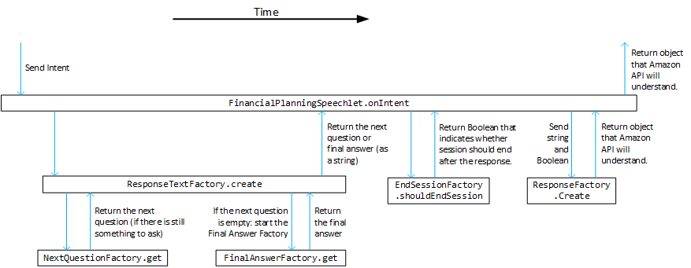

# Project structure

All the code for this assignment can be found in `FinancialPlanning/src/main/java/com/ortecfinance/financialplanning/`. We will continue to build on the `Java` code in there. Background information for Amazon Alexa skills can be found here:

```
FinancialPlanning/src/main/resources/alexa-reference.md
```

The main source code is in:

```
FinancialPlanning/src/main/java/com/ortecfinance/financialplanning/
```

There are also many unit tests that test the source code. They test whether specific scenarios work out as intended and can point out unexpected behaviour (and therefore possibly bugs) before deploying. It is likely some unit tests will fail when you build at some point during the case. If so, investigate what the unit test is testing exactly to find out what went wrong in your code. The unit tests can be found in:

```
FinancialPlanning/src/main/test/java/com/ortecfinance/financialplanning/
```

_Hint: certain tests are ignored, they can safely be ignored for the first assignment but for the extra assignments they may prove useful. You can run them by removing the `@Ignore` annotation._

# What happens in the code?

As long as the Financial Planner is active (i.e. has been launched and has not stopped yet, this is called a session), everything you say is interpretated and made into an IntentRequest (intent) by the Amazon server. The server uses `intents.json` to determine which sentence should result in which IntentRequest and which variables are associated with it.

_Hint: You do not have to update the `intents.json` for the various assignments._

Then, the following happens (see also diagram below):
1. In the `FinancialPlanningSpeechlet` the `onIntent(..)` method is called with the Intent as a parameter.
2. This method calls `ResponseTextFactory.create(..)` to build and retrieve the response that must be spoken.
3. Then the method calls `EndSessionFactory.shouldEndSession(..)` to determine whether the session must be ended after the next response. 
3. Then the method calls `ResponseFactory.Create(..)` to transform the results of the previous two steps to an object the Alexa API understands.
4. This object is returned by `onIntent(..)` and is handled by the Amazon server. The server will send the corresponding audio to the Amazon Echo to play and will end the session if needed.

Within the `ResponseTextFactory.create(..)` method (step 2 above):
1. It will store any supplied variables in the `Session` object, to remember them throughout the session
2. It will then use the `NextQuestionFactory` to determine what question to ask next. If this results in an actual question, that question is returned. If not, apparently all questions have already been asked and `FinalAnswerFactory` is called to compile the final answer. 

The `FinancialPlanningIntents` class also includes the texts of all responses (as constants) and the keys of the intents that we have to handle.



# Warm-up Assignment: Update welcome message ★

We will start by updating the welcome message Alexa says when we start the skill.

## Implementation

1. Go to the `FinancialPlanningSpeechlet`
2. Update the welcome message

Now we must deploy and test the code.

## Deploy & Test

1. Select `Build deployment` in the top right and click the play button.
    * You can skip unit tests with `Build deployment (skip tests)` and you can then still deploy on Alexa (no guarantees it will work though).
2. Go to Tools -> Update AWS Lambda | Java -> select _(Echo name on sticker)_ and click update.
3. Test on your Echo by saying: "Alexa, start financial planning _(Echo name on sticker)_"

These steps have to be done for every code change in order to update your Alexa skill.

_Hint: if you update the welcome message every time before you deploy you'll know the deployment worked!_

_Caution: you can skip the unit tests if you are stuck and want to test on Alexa directly instead of with unit tests; we don't mind. But you cannot debug the code that is running on Alexa, so troubleshooting will be more difficult._

# Choose your path

As we now have tested the deployment procedure, we can move on to more substantial improvements. We offer you the choice on what to do next. There are two main paths. They do not exclude eachother; feel free to switch between them. 

**Path A: Improve the dialogue (leans to Computer Science)**
This focuses on improving the interaction between user and Alexa by working on the protocol. This path involves working on the program architecture (all files) and provides more insight on how Alexa internally works.
* Assignment A1: At the start Alexa asks three questions before giving the final answer. Add a fourth question asking for initial savings ★★★
* Assignment A2: When answering, you need to answer in a full sentence ("My financial goal is 5000") which is annoying. Apply the Dynamic Intent such that Alexa also understands when users just say the number "5000" ★★★★

**Path B: Improve the analysis (leans to Econometrics / Mathematics)**
This focuses on improving the final answer that Alexa returns. This path is more focused on financial analysis and making the response of Alexa sophisticated and useful. You will mainly work on 1 file and you need to adjust unit tests less often, compared to path A.
* Assignment B1: At the start Alexa can just say whether feasibility is High or Low. Expand the verdict such that it has more categories ★★
* Assignment B2: Expand the answer to include an estimation on what you can achieve ★★
* Assignment B3: Expand the answer such that Alexa also gives advice to fix a low feasibility ★★★★

# Path A: Improve the dialogue

## Assignment A1: Add a question ★★★

### Introduction
The financial planner has the following protocol:

- You say "Alexa start financial planning _(Echo name on sticker)_"
- Alexa asks you for your target amount
- You answer an amount (see `FinancialPlanning/src/main/resources/intents.json` for sample phrases)
- Alexa then asks you for your monthly deposit
- You answer an amount
- Alexa then asks you for your time to target (number of months)
- You answer an amount 
- Alexa states its analysis (based on your answers)

You are going to expand the code to be able to ask for your initial savings as well.

Have a look at the intents.json:

```
FinancialPlanning/src/main/resources/intents.json
```

In this file, the intent has already been added to the JSON. It is not yet handled by the `Speechlet`:

```
{
  "name": "SetInitialSavingsIntent",
  "slots": [
    {
      "name": "InitialSavings",
      "type": "AMAZON.NUMBER"
    }
  ],
  "samples": [
    "my initial savings are {InitialSavings}",
    "savings are {InitialSavings}",
    "my current savings are {InitialSavings}"
  ]
}
```

You do not have to change `intents.json` but you have to add Java code to handle this `SetInitialSavingsIntent`.

### Implementation steps

1. First verify that all code compiles and all tests are working by selecting `Run all Tests` in the top right of IntelliJ and clicking the play button next to it. 
2. Add an intent to `FinancialPlanningIntents` with the value `SetInitialSavingsIntent`.
3. Next add a question to the `FinancialPlanningSpeechlet`: "How much have you currently saved?". Also add a key here with the value `InitialSavings`.
4. Now update the following files: `EndSessionFactory`, `NextQuestionFactory`, `FinalAnswerFactory` (function `get`) and `ResponseTextFactory` with the newly created constants. The new functionality should be very similar to the goal amount functionality. Make sure to always add it *after* the other intents/questions, so as the *fourth* intent/question!

### Optional: Verify the updated code by simulating the skill

You can use the `FinancialPlanningTestSimulation` to verify the new intent works as expected. The `FinancialPlanningTestSimulation` will simulate a request of a certain intent and log the resulting response along with the variables stored in the session by the intent. It shows how to use the simulation for the `SET_GOAL_AMOUNT_INTENT`, but it can be modified for any other intent.

It is possible to comment/uncomment requests or add your own request for test purposes. You can use the `createSetInitialSavingsIntent()` to simulate the new `SetInitialSavingsIntent`, if the output values are correct you can confidently deploy it.

### Unit tests

There are unit tests available (in `src\test\`) to check whether existing code still works as intended. Unit tests are common practice when developing professional software as they guard you against breaking existing functionality when changing your software. In this workshop they can help you to find bugs before you deploy your code. However, some unit tests need to be adjusted as well as the expected logic changes, otherwise you get _false positives_.

Expand/adjust the unit tests in line with your new code: `EndSessionFactoryTest`, `NextQuestionFactoryTest` and `ResponseTextFactoryTest`.

Run the tests again (by selecting `Run all Tests` in the top right of IntelliJ and clicking the play button next to it).

If you run into problems while running the unit tests, verify the order of the questions did not change, because changing the order will make updating the unit tests much harder. If you are stuck you can also skip the unit tests and deploy immediately, no guarantee that it will actually work though.

_Hint: the Deploy & Test instructions include a method for deploying without running unit tests, feel free to use it if you are stuck._

### Deploy

Deploy the code! (Follow the Deploy & Test instructions).

Do a samplewise manual test whether the code indeed works as intended. Construct your cases such that it makes a difference how high the supplied initial savings are, and check that Alexa provides the corresponding analysis!

## Assignment A2: Dynamic numbers ★★★★

Enable Alexa to understand your answer if you only provide a number for each question instead of full utterances. 

Example target conversation:

```
Alexa: What is the amount you need to achieve your financial goal?
User: 20 000
Alexa: What will your monthly contribution be? 
User: 200
Alexa: How many months are left until the goal is achieved?
User: 68
```

Instead of disclosing all necessary implementation steps, we invite you to find the steps yourself using these hints:
* In this approach all user responses map to the `SET_DYNAMIC_NUMBER_INTENT`, so every time the same intent is passed through in the code. You will have to figure out a way to decide what question the user answered, as it could be any of the four questions.
* Take a look at the `DynamicNumberKeyFactory`, it includes a crucial part of the puzzle.
* In the assignment A1 the `SetInitialSavingsIntent` was added and handled, in this assignment you will have to start handling the `SetDynamicNumberIntent`. You can start by adding the `SetDynamicNumberIntent` in all places you added the 'SetInitialSavingsIntent'.
* You can use the `createDynamicNumberIntent()` function in the `FinancialPlanningTestSimulation` class to simulate the dynamic number intent. Use the output to determine if the dynamic number is working as intended. 

# Path B: Improve the analysis

## Assignment B1: More categories of feasibility ★★

### Introduction

Alexa only gives two verdicts: High or  Low. The answer is based on whether the expected end result (based on a 2.75% average return) is higher or lower than the target.

Extend the range of possible answers to four by also comparing with 1.5% and a 3.75% scenario.

In `FinalAnswerFactory` you can find these return rates as contants. In IntelliJ, the last two are in grey, indicating that they are currently never used in the code. This will change with this assignment.

```
    private static double BASELINE_YEARLY_RETURN   = 2.75 / 100;
    private static double STAGNATION_YEARLY_RETURN = 1.50 / 100;
    private static double HIGHGROWTH_YEARLY_RETURN = 3.75 / 100;
```

### Implementation steps

1. Go to `FinalAnswerFactory`. You will primarily change code in this class.
2. Inspect function `feasibility(..)`. It contains the logic for distinguishing between High and Low.
3. Rewrite the function to distinguish four cases. Make sure you return a suitable (tongue-in-cheek?) response for each of them:
   * Even with high growth you are not expected to reach your goal
   * With high growth you are expected to reach the goal, but not with baseline returns.
   * With baseline growth you are expected to reach the goal, but not with stagnation returns.
   * Even with stagnation returns you are expected to reach the goal.

### Unit tests

There are unit tests available (in `src\test\`) to check whether existing code still works as intended. Unit tests are common practice when developing professional software as they guard you against breaking existing functionality when changing your software. In this workshop they can help you to find bugs before you deploy your code. However, some unit tests need to be adjusted as well as the expected logic changes, otherwise you get _false positives_.

Expand/adjust `FinalAnswerFactoryTest` in line with your new code.

Run the tests again (by selecting `Run all Tests` in the top right of IntelliJ and clicking the play button next to it).

If you run into problems and are stuck you can also skip the unit tests and deploy immediately, no guarantee that it will actually work though. You can skip unit tests by selecting `Build deployment (skip tests)`.

### Deploy

Deploy the code! (Follow the Deploy & Test instructions).

Do a samplewise manual test whether the code indeed works as intended. In the unit tests of `FinalAnswerFactoryTest` you can find a specific case for each of the four scenarios. Replay a case with Alexa and check the outcome.

## Assignment B2: Expected end result ★★

The next assignment is to expand the answer, such that Alexa not only states the feasibility, but also says what the expected end value of your investments is, using function `expectedFinalAmount`.
It is up to you what the exact phrase will be, and which return rate(s) Alexa will use.

Instead of disclosing the necessary implementation steps, we invite you to find the steps yourself.

## Assignment B3: Provide advice ★★★★

In this assignment, you are invited to turn Alexa into an advisor. Expand `FinalAnswerFactory` such that If the feasibility is not optimal, Alexa will advise you what you can do to fix this. Possible options are:
* Lower the goal 
* Increase the monthly deposit
* Increase the time to target (a longer period should yield a higher feasibility if the deposit is positive) 

Come up with an algorithm that comes up with an advice such that the feasilibility becomes High. 

We leave it up to your creativity how to achieve this. You can try to work out and apply a mathematical formula, or maybe apply an iterative method (i.e. try a case and adjust if it is still not enough).

# Out of the box: Implement your own ideas

If you feel inspired, feel free to improve on the current skill with your own ideas. The goal is to create a skill that helps people achieve their financial goals. Use your imagination and knowledge to achieve that goal.
